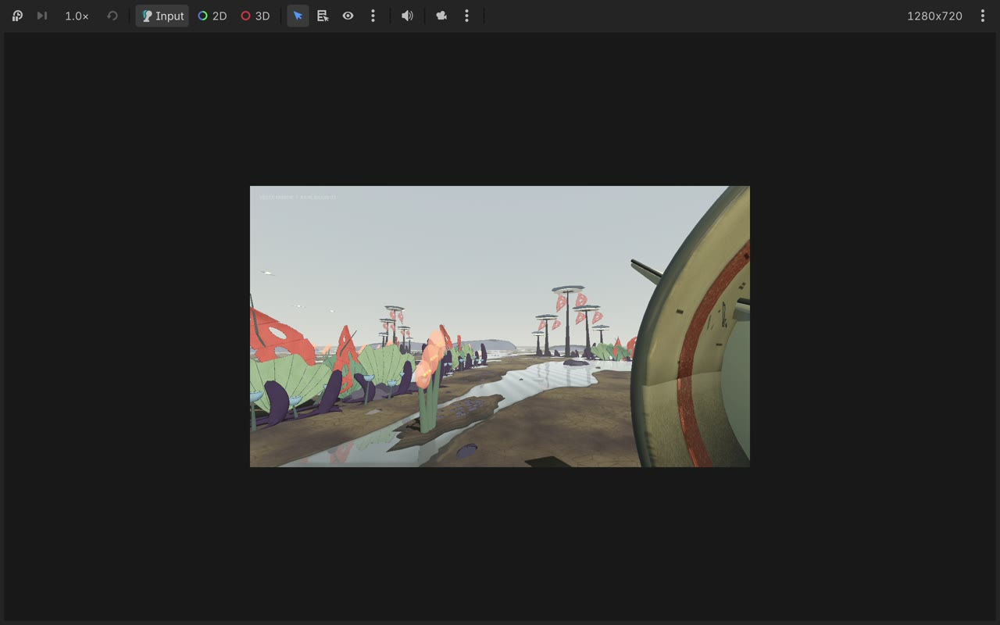

[English](README.md) | [Chinese / 中文](README-zh.md)

# Planet Mossara · 苔汐星

**苔汐星 · Mossara** is the name of the planet. “苔” (moss) evokes a damp ecology that grows slowly; “汐” (tide) evokes shallow-water basins and cyclical change.

A lightweight Godot 4 exploration experience made for an M1 Mac with 16 GB of memory. The focus is on walking slowly, watching ecological communities go about their lives, and listening to layers of ambient sound, without missions, win conditions, or survival stats.

This is a non-commercial fan study inspired by *Scavengers Reign*. It contains no screenshots, soundtrack recordings, or extracted assets from the series. Its procedural 3D environments explore the show's ecological atmosphere through matte colors, misty depth, and low-poly silhouettes reminiscent of 2D animation.

## Gameplay video

[](https://youtu.be/QHA-b4WFzQw)

[Watch the full gameplay video on YouTube](https://youtu.be/QHA-b4WFzQw) · 2 min 51 sec.

## Current experience

- No main quest, door puzzles, countdowns, or completion goals.
- Normal walking speed with a restrained 66° field of view; hold `Shift` to slow down and observe.
- A shallow basin after rain, with fully 3D ecological communities: branching Hi-hat trees with layered canopies, membrane plants, fan-leaf clusters, spore cups, and distant Rain Skimmers.
- Spore Trees, Pigoids, and Sterq Serpents feed, track, flee, and wander slowly.
- Procedurally generated wind, low tones, water droplets, and sparse creature calls, without external audio files.
- Approaching organisms automatically adds observation notes; open them with `Tab`.
- `Q` leaves a short scent trail; `E` sends a gentle ground pulse. Both are optional.
- The Compatibility renderer and low-poly models keep the experience lightweight for an M1/16 GB Mac.

See [ART_DIRECTION.md](ART_DIRECTION.md) for the art and sound principles.

## Running the project

Double-click `launch_godot.command`, or import this directory's `project.godot` in Godot 4 and run it.

Controls:

- `WASD`: move
- `Shift`: hold to walk slowly
- Mouse: look around
- `Q`: scent trail (optional)
- `E`: gentle pulse (optional)
- `Tab`: observation journal
- `Esc`: release the mouse

## Automated validation

```bash
/path/to/godot --headless --path . --script res://tests/smoke_test.gd
```

## Next steps

1. Add very slow changes in daylight and rainfall intensity.
2. Add creature sounds layered by distance, rather than background music.
3. Add ecological events that happen only once and can be missed, without turning them into quests.
4. Continue replacing remaining primitives with custom meshes and skeletal animation.

## Reference-based 3D models

The existing `assets/vesta_hihat_cluster.png` and `assets/vesta_foreground_flora.png` are translated into two reusable Godot scenes:

- `assets/models/vesta_hihat_cluster_3d.tscn`: five umbrella trees with roots, canopy ribs, scalloped crowns, perforated hanging membranes, and trunk collisions.
- `assets/models/vesta_foreground_flora_3d.tscn`: pleated fan leaves with raised veins, perforated coral fronds, dark finger plants, pearl growths, and hollow spore cups.

Four tree groves and six foreground beds are placed in the playable basin. Leaves and hanging membranes sway from anchored pivots. Meshes are baked into the scenes and shared between instances; static pieces are batched by material. The source drawings are references only, never billboards.

Rebuild the models after editing `scripts/plant_model_factory.gd` or `scripts/botanical_mesh.gd`:

```bash
/path/to/godot --headless --path . --script res://tools/build_plant_models.gd
```

Run `tools/preview_models.gd` with a graphical Godot session to save `assets/models/in_game_preview.png`.

The foreground flora now uses curved, rounded tube meshes with spreading roots, broader overlapping fan surfaces, smooth elliptical membrane openings, and a restrained ink-outline material. Pigment shading preserves the deep plum / sage / coral palette instead of washing it out under the basin light. These are stylized 3D interpretations; the original illustration's hand-drawn marks are not reproduced exactly.

## Basin ground art

The ground uses a continuous world-space tidal material: irregular shallow-water shapes, dark damp margins, muted clay and sediment bands, with slow painted sky-color movement across water. It is stylized water shading, not real scene reflections. `scripts/basin_terrain.gd` adds 680 batched gravel pieces, 30 low basalt rocks with convex collision, 18 silt banks, and distant basin shelves. The level's walkable base remains flat; low relief supplies the visual terrain detail. The rectangular puddles and repeated ground pattern have been removed.

`tools/preview_models.gd` now saves the ground-focused in-game view to `assets/models/ground_preview.png`.

## Blender creature pass

Pigoid and Sterq now use the rigged Blender models in `assets/creatures/models/` instead of primitive shapes. Editable `.blend` files, baked skin textures, build scripts and known visual limitations are documented in `assets/creatures/README.md`. Idle, walk and feeding/alert clips are connected to the existing ecology behavior.
